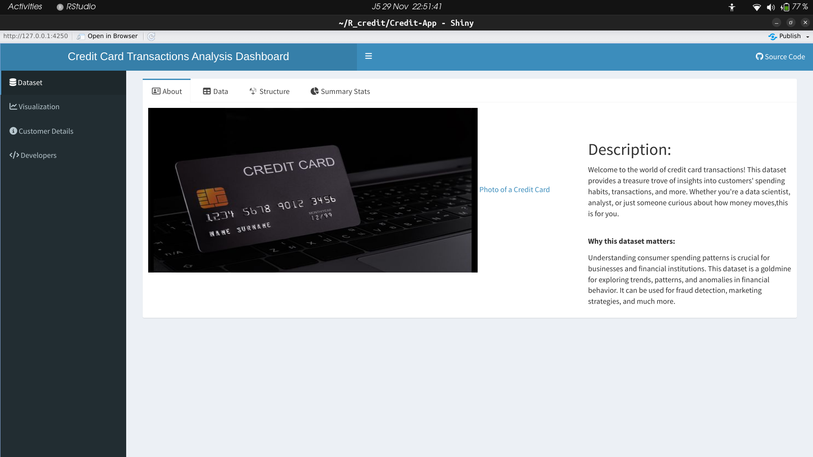
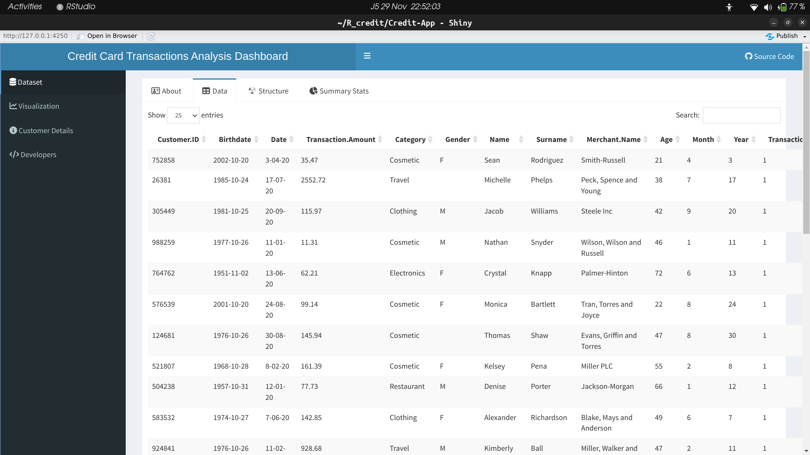
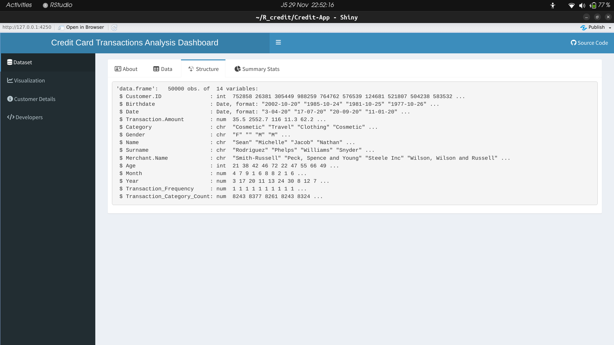
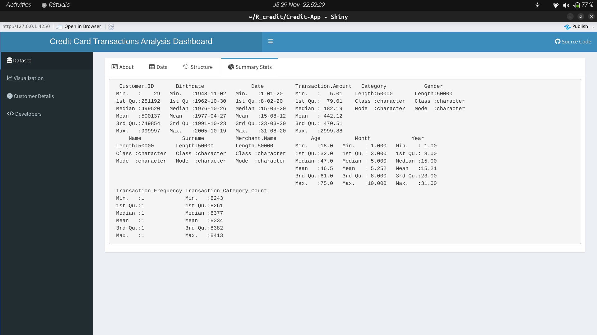
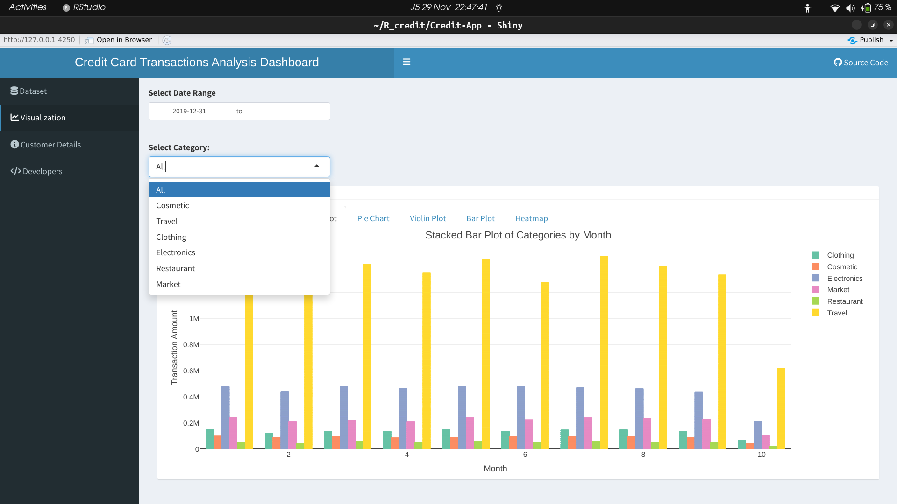
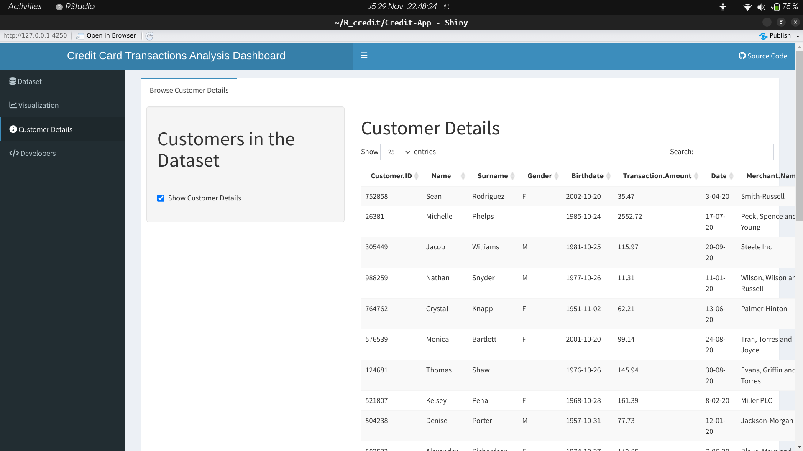

# Credit Card Transaction Dataset Project

## Table of Contents
- [Dataset Overview](#dataset-overview)
- [Features](#features)
- [Structure of the Repository](#structure-of-the-repository)
- [The App](#the-app)
    - [Intro](#intro)
    - [Data](#data)
    - [Structure](#structure)
    - [Summary](#summary)
    - [Plots](#plots)
    - [Customer Details](#customer-details)
- [Why Analyze?](#why-analyze)

## Dataset Overview:

This dataset provides a treasure trove of insights into customers' spending habits, transactions, and more. Whether you're a data scientist, analyst, or just someone curious about how money moves, this dataset is for you.
The dataset itself can be found from [here](https://www.kaggle.com/datasets/rajatsurana979/comprehensive-credit-card-transactions-dataset)

## Features:

1. **Customer ID:** Unique identifiers for every customer.
2. **Name:** First name of the customer.
3. **Surname:** Last name of the customer.
4. **Gender:** The gender of the customer.
5. **Birthdate:** Date of birth for each customer.
6. **Transaction Amount:** The dollar amount for each transaction.
7. **Date:** Date when the transaction occurred.
8. **Merchant Name:** The name of the merchant where the transaction took place.
9. **Category:** Categorization of the transaction.

## Structure of the Repository:

This repository has two main directories for the project:
**1. Credit_card_analysis_static**
This directory contains the static analysis of the data where we added some relevant columns for analysis and proper conclusions to be drawn from the dataset.
The R ggplot library is used for plotting in this directory.

**2. Credit:**
This directory involved the conversion of the static previously worked on previously into an interactive web application using the Shiny web framework package available for R applications.
The dynamic Plotly package was used to plot interactive plots for the application.

## The App
The shiny application application can be started by running the app.R script available in the Credit-App directory.

### Intro
The homepage introduction to the dataset and why it is useful.

### Data
Browse and discover several entries in the initial credit dataset.

### Structure
View the general structure of the the dataset.

### Summary
View a summarized version of the the dataset.

### Plots
Explore the provided set of plots using different categories know form the dataset and years.

### Customer Details
See customer details of the adjusted dataset(more_credit) in detail.

## Why Analyze?

**1. Insight into Customer Behavior:**
   Analyzing transaction frequency, amount, and categories provides insights into customer behavior and preferences.

**2. Temporal Trends:**
   Analyzing transactions over time helps identify temporal trends, seasonality, or patterns valuable for understanding customer behavior.

**3. Identifying Outliers:**
   Plots like boxplots and histograms aid in identifying outliers in transaction amounts, allowing for further investigation.

**4. Demographic Analysis:**
   Age and gender analysis helps understand the demographics of customers and their spending patterns.

**5. Category Insights:**
   Analyzing transaction categories provides insights into which types of merchants or transactions are more common among customers.
